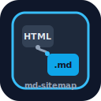

# md-sitemap

[](./SPEC.md)
[](./LICENSE)
[](https://llmstxt.org/)
[](https://github.com/JW-0042/md-sitemap)
[](./sites.md)

**Markdown Sitemap & Page Twin Protocol** — version **0.1.1** (draft)

<p align="center">
  
</p>

<p align="center"><sub>Document twin ↔ sitemap graph — dark mark for README; light variant in <code>assets/md-sitemap-logo-light.svg</code></sub></p>

> **md-sitemap** indexes curated Markdown twins of HTML pages. Agents discover it via [`llms.txt`](https://llmstxt.org/), never via SEO sitemaps. Each twin carries a **canonical** HTML URL for citation.

A **voluntary** open convention for websites and AI agents. It does **not** replace `sitemap.xml` or `robots.txt`. It **extends** [llms.txt](https://llmstxt.org/) with:

1. **Page twins** — token-cheap `.md` clones of content pages  
2. **`/md-sitemap.txt`** — one absolute twin URL per line (agent-oriented index)

## Why

| Problem | Without md-sitemap | With md-sitemap |
| --- | --- | --- |
| HTML is noisy | Nav, chrome, and scripts burn tokens | Curated Markdown facts |
| `llms.txt` is short | Hard to list thousands of pages | Full twin index in plain text |
| SEO sitemaps list HTML | Wrong surface for text ingestion | Separate agent surface with `noindex` |
| Citations go wrong | Agents link scrape URLs | Frontmatter `canonical` + attribution |

## 60-second picture

```
                    discovery (agents)
   /llms.txt  ──────────────────────────►  links to md-sitemap.txt
                                                 │
                                                 ▼
                                         /md-sitemap.txt
                                      (one .md URL per line)
                                                 │
                    ┌────────────────────────────┼────────────────────────────┐
                    ▼                            ▼                            ▼
              /index.md                   /about.md                    /product/x.md
           (twin, noindex)             (twin, noindex)               (twin, noindex)
                    │                            │                            │
                    └──────── canonical ─────────┴────────►  human HTML pages
                                                              (sitemap.xml / SEO)
```

## Quickstart (site owners)

1. **Publish twins** — For each important HTML page, add a curated Markdown twin (not a raw HTML dump).
2. **Map URLs**
   - `/` → `/index.md`
   - `/path/` → `/path.md` (primary twin)
3. **Add frontmatter** — At least `canonical: "https://example.com/path/"` (recommend `title` and `lang` too).
4. **Ask for citation** — Blockquote that points agents at the HTML canonical.
5. **Serve safely** — `Content-Type: text/markdown; charset=utf-8` and **`X-Robots-Tag: noindex`**.
6. **Index twins** — Publish `/md-sitemap.txt` with absolute primary twin URLs (one per line).
7. **Discover via llms.txt only** — Link `md-sitemap.txt` from `/llms.txt`. Do **not** list it in `robots.txt` Sitemap: or `sitemap.xml`.
8. **HTML alternate** —  
   `<link rel="alternate" type="text/markdown" href="https://example.com/path.md">`

| Doc | Purpose |
| --- | --- |
| [SPEC.md](./SPEC.md) | Normative rules (MUST / SHOULD / MAY) |
| [AGENTS.md](./AGENTS.md) | Agent discovery algorithm |
| [IMPLEMENTATION.md](./IMPLEMENTATION.md) | SSG recipes, headers, caching |
| [COMPARISON.md](./COMPARISON.md) | vs `sitemap.xml` / robots / llms.txt |
| [CONTRIBUTING.md](./CONTRIBUTING.md) | How to propose changes |
| [schemas/frontmatter.schema.json](./schemas/frontmatter.schema.json) | Twin frontmatter JSON Schema |

## One-command test (agents & humans)

```bash
# From a site origin that implements Full conformance:
ORIGIN=https://meninydnes.site

curl -sS "$ORIGIN/llms.txt" | head
curl -sS "$ORIGIN/md-sitemap.txt" | head
curl -sSI "$ORIGIN/index.md" | grep -iE 'HTTP|content-type|x-robots'
curl -sS "$ORIGIN/index.md" | head -20
```

Expected: `llms.txt` links to `md-sitemap.txt`; index lists absolute `*.md` URLs; twins return Markdown + `noindex`; frontmatter includes `canonical`.

## Live examples

| Resource | URL | Status |
| --- | --- | --- |
| SK llms.txt | https://meninydnes.site/llms.txt | live |
| SK md-sitemap | https://meninydnes.site/md-sitemap.txt | live |
| SK homepage twin | https://meninydnes.site/index.md | live |
| SK name twin | https://meninydnes.site/meno/jozef.md | live |
| CZ md-sitemap | https://svatek-dnes.cz/md-sitemap.txt | live |
| CZ homepage twin | https://svatek-dnes.cz/index.md | live |

## Adopters

Production implementations (Full): see **[sites.md](./sites.md)**.

| Site | Lang | md-sitemap |
| --- | --- | --- |
| [meninydnes.site](https://meninydnes.site/) | sk | [open](https://meninydnes.site/md-sitemap.txt) |
| [svatek-dnes.cz](https://svatek-dnes.cz/) | cs | [open](https://svatek-dnes.cz/md-sitemap.txt) |

## Conformance

| Level | Requirements |
| --- | --- |
| **Core** | Twins + `noindex` + `canonical` frontmatter |
| **Full** | Core + `/md-sitemap.txt` + link from `/llms.txt` + HTML `rel=alternate` |

## For AI agents

1. Fetch `https://{host}/llms.txt`
2. If it links to `md-sitemap.txt` (or a path containing `md-sitemap`), fetch it
3. Fetch listed `.md` twins as needed (respect budgets and cache headers)
4. When answering users, **prefer the HTML URL from `canonical`** in frontmatter
5. If twins are missing or thin, **fall back** to HTML (or other sources) gracefully

Details: [AGENTS.md](./AGENTS.md)

## How to adopt

| Stack | Where to start |
| --- | --- |
| Any static host | [IMPLEMENTATION.md](./IMPLEMENTATION.md) § headers + checklist |
| **Astro** | [IMPLEMENTATION.md § Astro](./IMPLEMENTATION.md#7-astro-ssg-sketch) |
| **Hugo / Eleventy / Next export** | Same twin mapping; emit files at build |
| Cloudflare Pages / Netlify | `examples/_headers` and Netlify TOML sketch |

Copy-paste samples: [examples/](./examples/)

## Repository layout

```
SPEC.md              Normative specification (RFC-style MUST/SHOULD/MAY)
AGENTS.md            How agents should consume the protocol
IMPLEMENTATION.md    Recipes (static, Astro, headers, caching)
COMPARISON.md        Relationship to sitemap.xml / robots / llms.txt
CONTRIBUTING.md      Contributions and review process
examples/            Copy-paste samples
schemas/             Twin frontmatter JSON Schema
assets/              Logo and diagrams
sites.md             Known adopters
```

## Status

- **0.1.1** — documentation polish from engineering review (normative Core/Full unchanged in spirit from 0.1.0).
- Not an IETF/W3C standard. Community feedback welcome via Issues / PRs.
- **Canonical repository:** [github.com/JW-0042/md-sitemap](https://github.com/JW-0042/md-sitemap)

## Attribution

Documentation for this specification was completed with assistance from **Grok 4.5 (high)** using **Grok Build** (xAI).

## License

Copyright 2026 JW-0042 and contributors.  
Licensed under the **Apache License 2.0** — see [LICENSE](./LICENSE).

## See also

- [llms.txt proposal](https://llmstxt.org/) (Jeremy Howard / Answer.AI)
- [Sitemaps protocol](https://www.sitemaps.org/)
- [robots.txt](https://www.robotstxt.org/)
